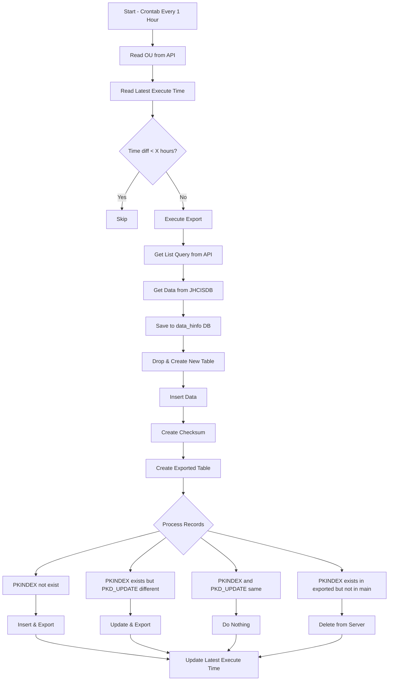

1. corntab เพิ่มคำสั่ง ทุกๆ 1 ชั่วโมง
2. reader own ou from api
3. reader lastest excute time from file lastest_excute_time.txt
4. if lastest excute time is less than x hour from ou [export_every_hours], then skip
5. else excute export
    - Get list all list query from API `query_map`
    - Get data from JHCISDB with list query
    - Save data to data_hinfo DB in MySQL by used `[name table]_powerpcu` from query_map
      - Drop table and create new table with same column as data
      - Insert data to `[name table]_powerpcu` table
      - Create checksum by 2 columns `PKINDEX`, `PKD_UPDATE` and save to DB and make index
      - Create table `[name table]_powerpcu_exported` with columns `PKINDEX`, `PKD_UPDATE`, `D_UPDATE`, `D_DELETE`
      - Calculate in this table:
        - If data `PKINDEX` does not exist then insert data to this table and export to server
        - If data `PKINDEX` exists but `PKD_UPDATE` is different then update data in this table and update data to server
        - If data `PKINDEX` and `PKD_UPDATE` are same then do nothing
        - If data `PKINDEX` exists but in table `[name table]_powerpcu` does not exist then update data to server with delete flag
6. update lastest excute time to file lastest_excute_time.txt

