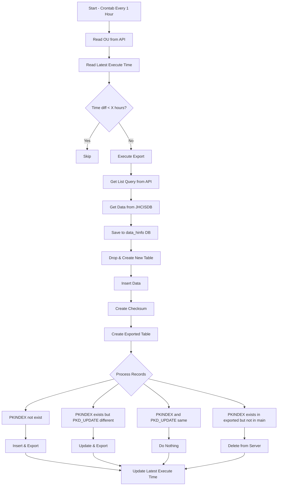

1. corntab เพิ่มคำสั่ง ทุกๆ 1 ชั่วโมง
2. reader own ou from api
3. reader lastest excute time from file lastest_excute_time.txt
4. if lastest excute time is less than x hour from ou [export_every_hours], then skip
5. else excute export
  5.1 get list all list query from api [query_map]
  5.2 get data from jhcisdb with list query
  5.3 save data to data_hinfo db in mysql by used [name table]_powerpcu from query_map
    5.3.1 drop table and create new table with same column as data
    5.3.2 insert data to [name table]_powerpcu table
    5.3.3 create checksum by 2 column [PKINDEX, PKD_UPDATE] and save to db and make index
    5.3.4 create table [name table]_powerpcu_exported with column [PKINDEX, PKD_UPDATE, D_UPDATE, D_DELETE]
    5.3.5 calculate in this table
      5.3.5.1 if data [PKINDEX] is not exist then insert data to this table and exported to server
      5.3.5.2 if data [PKINDEX] but [PKD_UPDATE] is not same then update data to this table and update data to server
      5.3.5.3 if data [PKINDEX] and [PKD_UPDATE] is same then do nothing
      5.3.5.4 if data [PKINDEX] is exist but in table [name table]_powerpcu not exit then update data to server by delete flag
6. update lastest excute time to file lastest_excute_time.txt

